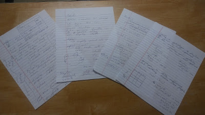

## Introduction

In this programming assignment, we are going to explore a classic in
Computer Science\! This is Conway's Game of of life. It will be a good
practice for using vectors, as well as making use of our nice termmanip.h
library.

Conway's game of life was created by John Conway, a British
mathematician, some time in the 1970's. It was an example of a problem
first proposed by John Von Neumann (creator of the famous computer
architecture). Von Neumann's problem was in the study of
self-replicating machines. This proposal led Conway to create this
little game, which is one of the first examples of a field called
cellular automata (CA).

The basic idea of a CA is to use a simple set of rules to create a very
complex pattern. Don't be fooled by the easiness of understanding the
rules. Conway's game of life, when played on an infinite grid, is
capable of simulating a Turing machine. This means that the simple rules
we are about to look at are capable of universal computation. In fact,
randomly generated rule sets have a fairly high probability of being
capable of universal computation. Maybe the universe is geared toward
forming computers\!

## The Game of Life

Conway's game of life is played on an orthogonal grid. Each element in
the grid is a cell, and the cell is either alive or dead. Each grid
arrangement is used to generate the next "generation" of cells. The fate
of each cell is determined by it's neighbors. Take for instance, the
cell 0. The X's are it's neighbors:

`XXX`  
`X0X`  
`XXX`

So each cell has 8 neighboring cells. The number of living neighbors
surrounding a cell are what determines what the cell does in the next
generation. The rules that the game follows are:

1.  A living cell with fewer than 2 living neighbors dies. (Starvation)
2.  A living cell with more than 3 living neighbors dies. (Overcrowding)
3.  A living cell with 2 or 3 living neighbors lives on. (Stability)
4.  A dead cell with exactly 3 living neighbors will become a live cell
    (Reproduction)

So you can see that counting the cells around each cell, plus that
cell's state, determines what the cell does. Generally, this results in
weird and wonderful patterns. There are some patterns that are
interesting, however. Take for instance:

`   `
`***`
`   `

Following those rules, there are two possible iterations which this
oscillates through.

`   `
`***`
`   `
Followed by:

` * `  
` * `  
` * `

Then:

`   `
`***`
`   `
And so on. This is called a spinner. The next interesting one is the
glider. Use a sheet of paper and checkout what the glider does:

` * `  
`  *`  
`***`  
`   `

The glider moves\! How cool is that?

There are some other interesting shapes, and a few are included with the
assignment Director. That way you can run them through your own
programs.

So now, we want to program this thing\!

What follows is a specification of the program as well as some ideas to
get you started.

## Programming the Game of Life

Our program will be called "life". It can be invoked in one of two ways.
The first way is like so:

` ./life`

This will cause the program to start with a random grid, and then begin
executing the rules.

The other way of invoking the program is as:

` ./life filename`

Where it loads the grid from the filename.

Remember how files worked from last semester? Also you'll need to
remember the command line argument handling from Lab 1. (You maybe even
want to copy and paste that little function I gave you\!)

Be sure to test your program in both random mode and in the files
included in your directory.

  - spinner
  - glider
  - gosper-gun

The grid is displayed on the screen, with a "\*" for a living cell and a
space " " for a dead cell.

## Some Tips

  - We will assume that we are playing on an 80x24 grid.
  - I made a cell class and a grid class.
  - My grid class contains a vector of vectors to form the grid.
  - My grid class contains a count neighbor function.
  - My grid class contains an update function which does the following

<!-- end list -->

    1.  Update the living status of each cell. (Which entity does this
        is a tricky point of concern\!)
    2.  Count the living neighbors of each cell and notify the cell of
        the living status.
    3.  Display the grid

<!-- end list -->

  - Your main function should load either a random grid or a grid
    contained in a file.
  - After loading from the grid your program should enter an infinite
    loop which consists of updating the grid and then using usleep (see
    "man usleep" for more information) to delay between each frame.

The biggest tip is this. Asking yourself the right questions is the most
important thing you can do. Try designing first and then coding, and
then identify additional questions that come up. Keep that conversation
between yourself and your code going, and you can write any program I
throw at you\!

Also, talk to each other. Talk to rubber ducks (that's a real method).
Draw pictures on windows with crayon. Do whatever you have to do to
tease out all of the detail and enjoy and savor the complexity that you
create.

## Notes

Handwritten notes are important\! Here are the ones I drew up before
writing even one line of code:

